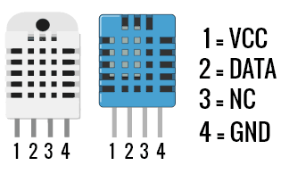
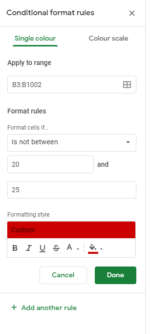

# Raspberry Pi DHT Sensor-Log
<br>

## Table of Contents
* [What is this project?](#what-is-this-project)
* [Features](#features)
* [Planned updates](#planned-updates)
* [Installation & Setup](#installation-and-setup)
* [Example Images](examples-of-the-program-can-be-found-in-the-[images-folder](/images).)

## What is this project?

This project allows users record sensor data from the Adafruit DHT sensors (either the DHT11 or DHT22) and make a log of it in a Google Spreadsheet. This project utilizes the Google gspread API to allow automatic recodings viewable anywhere in the world with a internet connection! The project also has a json file for simple end user configuation
<br>

### Features
* simple setup
* Global acces to sensor data
* Highlight rows if they fall outside preset range
<br>

### Planned updates
* compatibility with more Sensor modules 
* ability to have SMS push notifications
* Duplicate version writtrn in C-sharp
<br>

## Installation and setup

This project assumes that you have a raspberry pi running raspbian lite and are able to do a ssh connection to your Raspberry pi.

1.)
Firstly your going to need to create a [Service Acount](https://docs.gspread.org/en/latest/oauth2.html#enable-api-access-for-a-project) to enable API acces. This what allows the raspberry pi to talk to your Google spreadsheet. **Do not** worry about steps 6 to 8, we will cover that in here. In the end you should have a json file loooking like code linked below, safe this somewhere where you will be able to find it later.
```json
{
    "type": "service_account",
    "project_id": "name of the the project",
    "private_key_id": " ",
    "private_key": " ",
    "client_email": "email of the bot",
    "client_id": "",
    "auth_uri": " ",
    "token_uri": " ",
    "auth_provider_x509_cert_url": " ",
    "client_x509_cert_url": " "
}
```

2.)
Next we need to share the [Google spreadsheet](https://www.google.com/sheets/about/) with the bot. Look in your json file for a line labled `client_email:`, copy that email address and share your Spreadsheet to that email, remembering to give the bot edit permission.
<br>

3.)Next we can wire our sensor to our raspberry pi(RPi). The wiring will differ slightly depending on if you have a built-in risitor or not. This risitor is called a pull-up risitor and its what allows the RPi to read the digital signal. if you are not sure which type you have-look if its connected to a board, these ones also usally have a small LED indicating power. If yours matchs either of the above descrition folllow the first section and if not, follow the seconed section.

* This section is for those who have a senosr with a built-in pullup resistor. These are very simple to connect, simply connect the pin labeled **VCC** to a 3.3 volt pin on the RPi, **GND** to a ground pin on the RPi, and lastly connect the **DATA** pin to any GPIO pin on the rpi. Refer to the image below for which pins on the RPi are what.
* For those who don't have a built-in resistor with there sensor we will need to add one now. Connect the pins as follows, **VCC** to the 3.3 volt pin on the RPi, **GND** to any ground pin on the rpi, **DATA** to any GPIO pin on the RPI and then add a resistor of 4.7 to 10k ohms resistance between **DATA** and **VCC**. <br>
* The **VCC** could also be connected to the 5 volt pin on the RPi but, there have been some reports of this causing the Sensor to heat up ever so slighty.
  


Now we can start setting up the raspberry pi. Run the following commands in the terminal, this will update and install the requird libraries.

```
sudo apt update && sudo apt upgrade -y
sudo apt install python3-pip -y
sudo pip3 install board
sudo pip3 install adafruit-circuitpython-dht  
sudo pip3 install gspread
sudo pip3 install oauth2client
```

For those you want one long commmand instead, copy the below block (this does the same thing as listed above just in one big command instead).
```
sudo apt update && sudo apt upgrade -y && sudo apt install python3-pip -y && sudo pip3 install board && sudo pip3 install adafruit-circuitpython-dht && sudo pip3 install gspread && sudo pip3 install oauth2client
```

4.) Next we will install git and clone this reposity locally onto your machine.
```
sudo apt install git
git clone https://github.com/sprotax/RaspberryPi-DHT-sensor-Log.git
cd RaspberryPi-DHT-Sensor-Log
ls
```
the last command should print a list as shown below. <br>

<br>
In this folder your going to want to add your Google json authenication file. The simplist way to do this is to create a new file and then copy the infomation over. run `sudo nano gspread.json`, next open your Google json authenication file and do a **ctrl+a** followed by **ctrl+c** (Use cmd key instead on Mac's). Then go back to your ssh application and right click in the window. this should copy and paste the infomation from your machine onto the raspberry pi.

5.) After that, we will configure the `config.json` file. This will tell the script how you want it to run. <br>
* info -- Ignore this section, thats just for your reference.
* certification -- This is where we give the requird infomation to allow communication with the spreadsheet
    * json-authenentication -- This is the file location of the Google json authenication file, if you follewed the guide step by step it would be ./gspread.json, otherwise its ./{name-of-file}.json.
    * spreadsheet-name -- This is the title of the Google spreadsheet
* logger -- This all the infomation the script requires to run
    * DHT-type -- Is this a DHT11 or DHT22 sensor
    * GPIO-pin -- Which pin is the sensor connected to. It must be said in thhe format of board.{pin} and the pin number must be the the gpio pin not the physical pin. see 
    [GPIO pins](images/GPIO.png) for a chart.
    * Max-Lenth -- How long do you want the google spreadsheet to get
    * interval -- How long should it wait between running, measued in seconds.
    * Store-Data-Locally -- Should the data also be added to the local log file, use true or false.
    
6.) Lastly were going to add this scipt to crontab to start everytime the raspberry pi starts. To do this type `crontab -e` (If this is your first time entering crontab it will ask which editor to use, pick 1 for nano as its the simplist). Then go to the botom of the file and add `@reboot python3 /home/pi/Temp/Sensor-log.py` It also a good idea to automcatilcy restart the raspberry pi once a week. to do this add `@weekly sudo reboot` which wil restart the raspberry every sunday at midnight. This will also create a new log file in the logs folder.

7.) If you ever wish to stop the script either had a `#` infront of the line in crontab or add a file name **stop** in the Temp folder. to do this type `sudo nano stop` and **ctrl+s** followed by **ctrl+x**.

8.) Optional color highlighting in Google spreadsheet. To make it easier I recomand you run the script first and get 10 or so lines filled in. Then open your Google spreadsheet and left click on the **B** at the top of the column, after that **ctrl** left click the first two rows. Then goto Format > Conditional formatting. Then set Format rules to Format cells if...`is not between`, then below add your two values. Optionally chnage the highlight color by clicking on the paint bucket below. Then Repeat these steps for column **C** if wanted. It's also a good idea to delete columns **D** to **Z** as these still count towards the 5 million total cell limit.
<br>


#### Example images
 &nbsp; Example images of the program can be found in the [images folder](/images)

